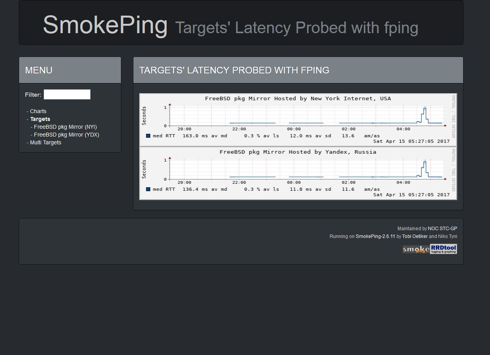

# 


Darkly Bootstrap Theme for [SmokePing](http://oss.oetiker.ch/smokeping/) Network Latency Grapher.


## Install instructions

```
1. Backup old basepage.html
2. Install the Darkly basepage.html
3. Install CSS (Botstrap) and JS (jQuery) files
3. Check the "<script src=..." part in the header and fix the paths to the *.js files if necessary.
   The default paths are taken from the FreeBSD OS.
   Without correct paths the Mouse Zoom function for the graphs won't work.
4. Change other definitions/parameters if necessary
```

## Todo

Convert ```<table>``` menu list to ```<ul> <li>```

## Changelog

- `16/04/2017`: Release
